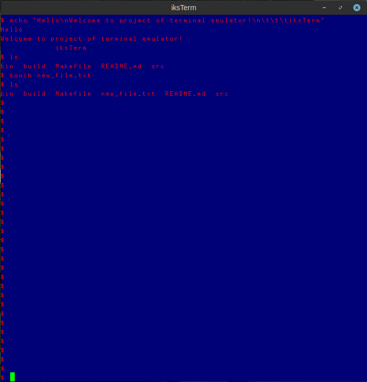

# terminal-emulator

[](http://www.wtfpl.net/about/)

Simple implementation of terminal-emulator in Linux

Consist of two programs:

- *iksTerm* - GUI terminal that you can launch on any shell or program
- *iksSh*   - simple shell

## iksTerm



Written on C using X11 and PTY, simple terminal that launches shell and can run different command.

[Technical details of realization](iksTerm/README.md)

Folder with sources: `iksTerm/`

### Build

**Dependences:**

- Compiler: `gcc`       (`sudo apt install build-essential`)
- Build util: `make`    (`sudo apt install make`)
- Graphic system: `X11` (`sudo apt install xorg`)

**Build:**

```bash
cd ./iksTerm
make # compile program in "bin/" dir
make install
man iksTerm # Man page of iksTerm
iksTerm -h
```

## iksSh

`in stage of development`
