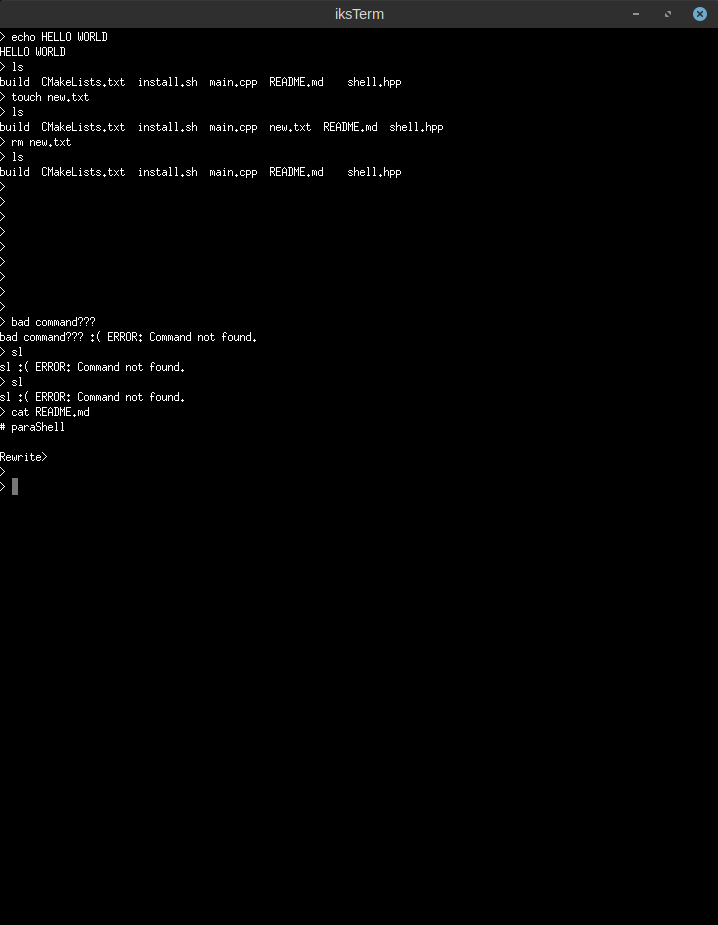

# terminal-emulator


A simple implementation of a terminal emulator for Linux, featuring a GUI terminal (`iksTerm`) and a basic shell (`paraShell`).

Consist of two programs:

- `iksTerm` - X11 terminal that you can launch on any shell or program.
- `paraShell`   - simple shell.

## iksTerm


Written on C using X11 and PTY, simple terminal that launches shell and can run different command.

[Technical details of realization](iksTerm/README.md)

Folder with sources: `iksTerm/`

### Build

#### Dependencies

- *Compiler*: `gcc` \
`sudo apt install build-essential`
- *Build util*: `make` \
`sudo apt install make`
- *Graphic system*: `X11` \
`sudo apt install xorg`
- *Compilation database*: `bear` \
`sudo apt install bear` \
(optional use with `make compile`)
- *Automated documentation*: `doxygen` \
`sudo apt install doxygen` \
(optional use with `make doxygen`) `Doxygen/html/index.html`
- *Manual*: `man` \
`sudo apt install man` \
(optional use with `make man`) `man iksTerm`

#### Installation

*Build:*
```bash
git clone https://github.com/khmelnitskiianton/terminal-emulator.git # clone repo
cd iksTerm
make # compile program store in "bin/" dir
./bin/iksTerm -h # local run
```

*Installation:*
```bash
sudo make install # install in /usr/bin
iksTerm -h
```

## paraShell



A simple shell for Linux. This project is implemented using fork and pipes. Written in C++ (since C++11 standart).
ParaShell has several internal commands:

- `cd` - change directory
- `exit` - exit from shell

and also provides extensible interface for adding new commands. Implemented using C++ inheritance.

### Build

#### Dependencies

- Compiler: C++11 compatible compiler (GCC ≥ 4.8.1 or Clang ≥ 3.3)

- Build system: CMake ≥ 3.10

- System libraries: Standard POSIX environment (Linux/Unix)

#### Installation

*Local build:*
```bash
git clone https://github.com/khmelnitskiianton/terminal-emulator.git # clone repo
cd terminal-emulator/paraShell
cmake -S . -B build
cmake --build build
build/paraShell
```

*Installation:*
```bash
cd terminal-emulator/paraShell
chmod +x ./install.sh
sudo ./install.sh # install in /usr/bin
```

## Docker

If you want to build & install this project in isolated container and see terminal you can use our docker.

*Install Docker:*

```bash
sudo apt install docker.io
```

*Build docker image:*

```bash
sudo docker build -t iksterm .
xhost +local:docker
```
*Run terminal in container:*

```bash
sudo docker run --rm -it --net=host -e DISPLAY iksterm
```

## License

This project is licensed under the WTFPL License. See the [LICENSE](LICENSE) file for details.